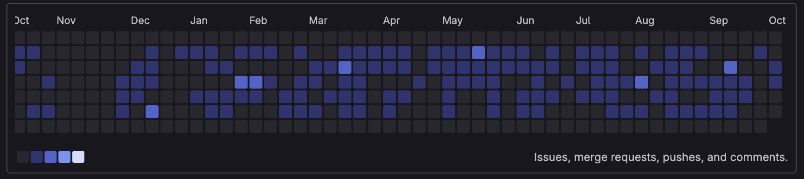

    

---

<h1 align="center">Hi, I'm João Marcos </h1>

<h3 align="center">Full Stack PHP Developer | Software Engineer | IT Professional</h3>

---

##  About Me

I'm a **Full Stack PHP Developer** with **3+ years of software development experience** and **10+ years working in Information Technology**.

I develop, maintain and evolve enterprise and government systems using **PHP, Laminas (Zend Framework), Laravel, PostgreSQL, JavaScript, HTML, CSS and REST APIs**.

Beyond software development, I have previous experience in **IT Management, Infrastructure, Databases, Information Security, Technical Support and Business Intelligence**, giving me a broad understanding of technology and business processes.

###  Education

*  Bachelor's Degree in Information Systems
*  Postgraduate Degree in Business Intelligence
*  Postgraduate Degree in Systems Analysis and Development
*  Currently pursuing a Postgraduate Degree in Software Engineering

###  Currently Learning

*  Java
*  Python
*  Artificial Intelligence
*  Process Automation
*  Modern Software Engineering practices

---

##  Tech Stack

---

##  Interests

* Backend Development
* Full Stack Development
* Software Engineering
* Artificial Intelligence
* Process Automation
* Data Analysis & Business Intelligence
* Clean Architecture
* System Design

---

##  GitLab Stats (private project)

<!-- GitHub Stats Here -->
